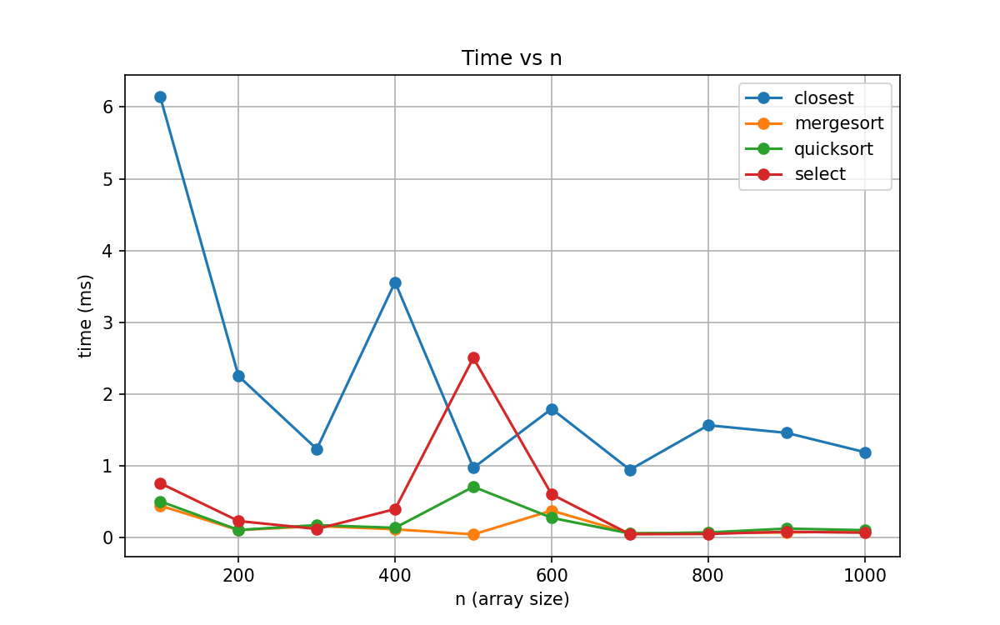
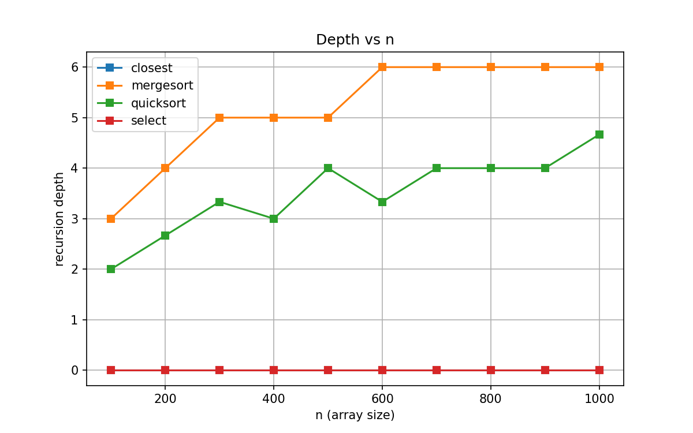

# Mukashev Sultanbek DAA Assignment 1 – Report

## Architecture Notes
The project is organized around reusable utilities and metrics:
- **Metrics** tracks comparisons, swaps, recursion depth. This allows direct observation of how the recursion tree unfolds.
- **Depth control**: QuickSort always recurses on the smaller partition, converting the larger one into a tail call, keeping depth `O(log n)`. MergeSort depth grows logarithmically due to halving arrays.
- **Allocations**: MergeSort allocates a single auxiliary buffer once, avoiding `O(n log n)` memory churn. QuickSort works in-place, with only stack frames as extra cost.
- **CSV Writer** collects results (time, depth, comparisons, swaps) so we can plot and analyze.

---

## Recurrence Analysis

### MergeSort
- Recurrence: `T(n) = 2T(n/2) + Θ(n)` from merging.
- Master Theorem (Case 2): `T(n) = Θ(n log n)`.
- Intuition: balanced binary recursion, each level does linear merge, so depth is log n.
- Metrics show comparisons ≈ `n log n`, depth ≈ `log n`.

### QuickSort (randomized)
- Recurrence: `T(n) = T(αn) + T((1-α)n) + Θ(n)` with expected α ≈ 0.5.
- Average-case: `Θ(n log n)` (by Master theorem on expected balanced splits).
- Worst-case: `T(n) = T(n-1) + Θ(n) = Θ(n^2)` if pivot is always bad.
- Our implementation reduces depth via smaller-first recursion. Depth ≈ log n on random data.

### Deterministic Select (Median of Medians)
- Recurrence: `T(n) = T(n/5) + T(7n/10) + Θ(n)` (median-of-medians split guarantee).
- Akra–Bazzi theorem gives `T(n) = Θ(n)`.
- Intuition: at least 30% elements are discarded each round, ensuring linear time.
- Constant factor is higher than QuickSelect, but asymptotics are linear.

### Closest Pair (Divide and Conquer)
- Recurrence: `T(n) = 2T(n/2) + Θ(n)` (splitting + linear strip merge).
- Master Theorem (Case 2): `T(n) = Θ(n log n)`.
- Intuition: splitting by median x-coordinate, then checking a constant number of neighbors in strip.
- Depth ≈ log n, similar to MergeSort.

---

## Plots

**

- **Time vs n**: Both MergeSort and QuickSort scale as `n log n`. QuickSort often slightly faster due to better cache locality, though MergeSort is more stable.
- **Depth vs n**: QuickSort shows log n growth (with variance from random pivots), MergeSort exact log n.
- **Deterministic Select** grows linearly, but with a larger constant factor than `Arrays.sort + index`.
- **Cache/GC effects**:
    - MergeSort’s single auxiliary array improves cache performance compared to repeated allocations.
    - QuickSort benefits from in-place swaps but may fragment cache due to partitioning.
    - For very small n, insertion sort cutoff reduces constant-factor overhead.

---

## Summary
- **Theory vs measurements align well**: MergeSort and QuickSort behave as `Θ(n log n)`, Select as `Θ(n)`, Closest Pair as `Θ(n log n)`.
- **Mismatch**: Although Select is linear in theory, experiments show `Arrays.sort + pick` is faster for small `n` due to constant factors.
- **QuickSort vs MergeSort**: QuickSort often wins in practice, even though both are `Θ(n log n)`. This reflects cache locality and lower constant factors.
- **Depth analysis** confirms log n growth in MergeSort and expected log n in QuickSort, with no stack overflows thanks to smaller-first recursion.
- **Conclusion**: Measurements support theoretical bounds, but also highlight constant-factor effects (cache, memory allocations, JVM GC) as crucial in practice.
